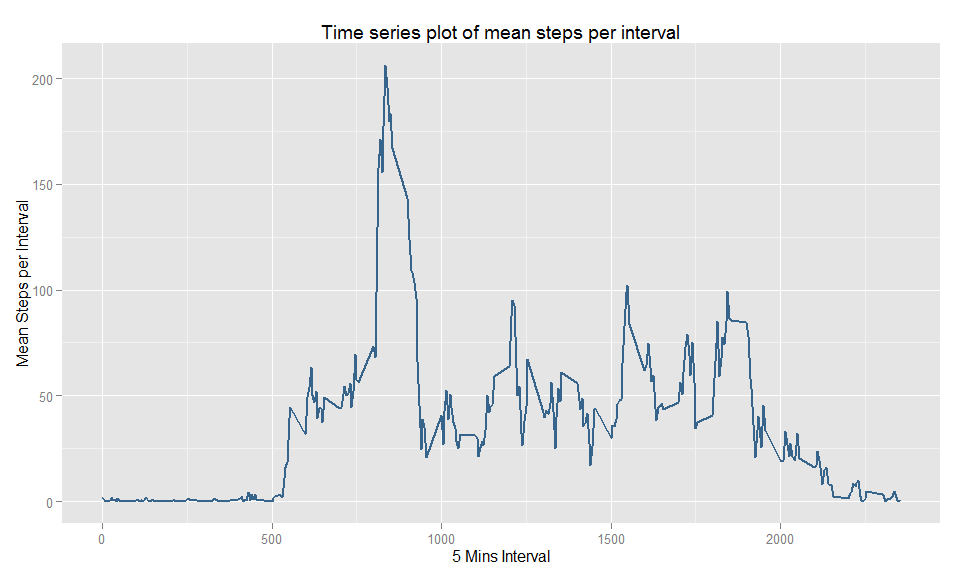

# Reproducible Research: Peer Assessment 1
George Xiao  
`r Sys.Date()`  

## Introduction
This assignment makes use of data from a personal activity monitoring device. This device collects data at 5 minute intervals through out the day. The data consists of two months of data from an anonymous individual collected during the months of October and November, 2012 and include the number of steps taken in 5 minute intervals each day.

[Here](https://github.com/rdpeng/RepData_PeerAssessment1) you can find the full description of this assignment. 

## Global Settings


```r
knitr::opts_chunk$set(fig.width=12, fig.height=8, fig.path='Figs/',
                      echo=TRUE, warning=FALSE, message=FALSE)
library(knitr)
library(ggplot2)
```

## Loading and preprocessing the data
Firstly, let's unzip the [data](https://d396qusza40orc.cloudfront.net/repdata%2Fdata%2Factivity.zip) (if you haven't done that) and load it into R.


```r
if(!file.exists("activity.csv")) unzip(zipfile="activity.zip")
activity <- read.table("activity.csv", sep = ",", header = T)
head(activity)
```

```
##   steps       date interval
## 1    NA 2012-10-01        0
## 2    NA 2012-10-01        5
## 3    NA 2012-10-01       10
## 4    NA 2012-10-01       15
## 5    NA 2012-10-01       20
## 6    NA 2012-10-01       25
```

There are three columns in the data:

- **steps**: Number of steps taking in a 5-minute interval (missing values are coded as `NA`).
- **date**: The date on which the measurement was taken in YYYY-MM-DD format.
- **interval**: Identifier for the 5-minute interval in which measurement was taken.

One thing we want to do before analysis is to change the **date** into the date type in R:


```r
activity$date <- as.Date(activity$date, "%Y-%m-%d")
```

## What is mean total number of steps taken per day?
Fistly, calculate the total number of steps taken per day:


```r
stepsPerDay <- aggregate(x = list(Steps = activity$steps), by = list(Days = activity$date), 
                  FUN = sum, na.rm=TRUE)
```

Secondly, let's create a histogram by library `ggplot2`:

```r
ggplot(stepsPerDay, aes(x = Steps)) + 
    geom_histogram(binwidth = 2000, col = "white", aes(fill = ..count..)) +
    scale_fill_gradient("Count", low = "grey60", high = "grey10") +
    labs(x = "Steps per Day", y = "Count") + 
    labs(title = "Histogram of the total number of steps taken each day")
```

 

Lastly, calculate and report the mean and median of the total number of steps taken per day:

```r
sprintf("The mean and median of the total number of steps taken per day is %.2f and %.2f", 
        mean(stepsPerDay$Steps), median(stepsPerDay$Steps))
```

```
## [1] "The mean and median of the total number of steps taken per day is 9354.23 and 10395.00"
```

## What is the average daily activity pattern?
To answer this question, I will make a time series plot of the 5-minute interval (x-axis) and the average number of steps taken, averaged across all days (y-axis):


```r
stepsMeanPerInterval <- aggregate(x = list(Steps = activity$steps), 
                              by = list(Interval = activity$interval), 
                              FUN = mean, na.rm=TRUE)

ggplot(stepsMeanPerInterval, aes(x= Interval, y = Steps)) + 
    geom_line(col = "black", size=0.7) +
    labs(x = "5 Mins Interval", y = "Mean Steps per Interval") + 
    labs(title = "Time series plot of mean steps per interval")
```

 

Then calculate which 5-minute interval, on average across all the days in the dataset, contains the maximum number of steps:


```r
maxSteps <- stepsMeanPerInterval[stepsMeanPerInterval$Steps == max(stepsMeanPerInterval$Steps), "Interval"]
sprintf("The '%s' 5 minutes interval contains the maximum number of steps, on average across all the days in the dataset.", 
        maxSteps)
```

```
## [1] "The '835' 5 minutes interval contains the maximum number of steps, on average across all the days in the dataset."
```


## Imputing missing values
Fistly, calculate and report the total number of missing values in the dataset:

```r
numNA <- sum(is.na(activity$steps))
sprintf("The total number of missing values in the dataset is %s.", numNA)
```

```
## [1] "The total number of missing values in the dataset is 2304."
```

Secondly, use mean for that 5-minute interval to fill in all of the missing values in the dataset. 


## Are there differences in activity patterns between weekdays and weekends?
